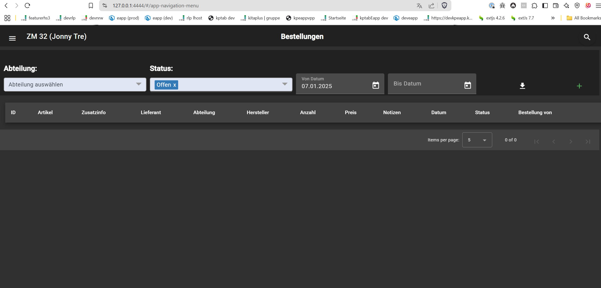

# zm32

#running the project

Running on windows
1. Install Docker and Docker Composer. Install Docker Desktop if necessary
2. run the following the file 'start-docker-build-prod.bat'
3. It will load all configurations and run the project on port 4444 on the localhost
4. The test data are provided for the showcase

Running on Linux
1. Install Docker and Docker Composer. Install Docker Desktop if necessary
2. Change to config directory and run the following the file 'start-docker-build-prod.sh' as root
sudo ./start-docker-build-prod.sh

Use Pin "0066" to login as a user

